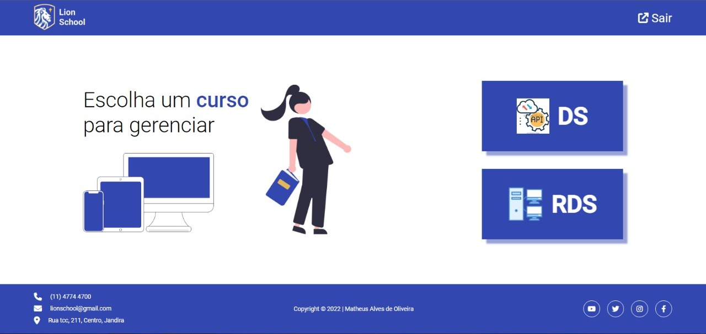
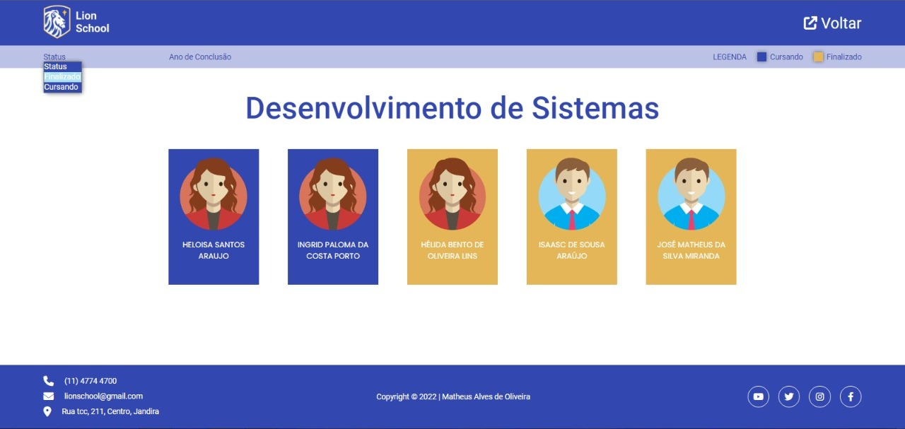
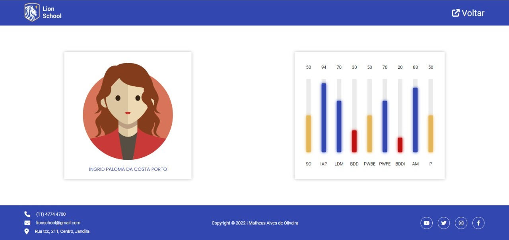

# Projeto Lion School

- Objective: Create a sistem to manage courses and students in a School
- Used technologies
  - HTML
  - CSS
  - JavaScript
  - Express
  - Node.js
  - Figma

<a href="https://www.figma.com/file/5HGbO0OkXsNFyKtw94mcvU/PWFE---Trabalho-Integrado---Matheus-Alves">See the design in figma</a>

 

<h2 align="center">Desktop images</h2>

 

